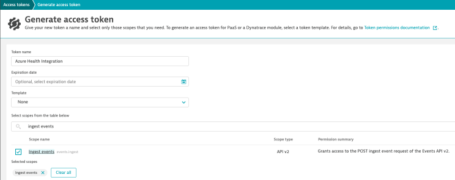
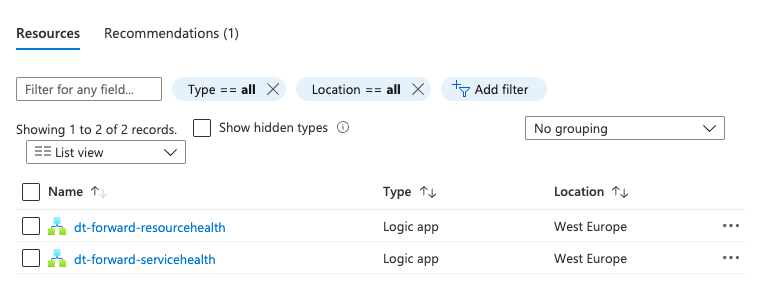
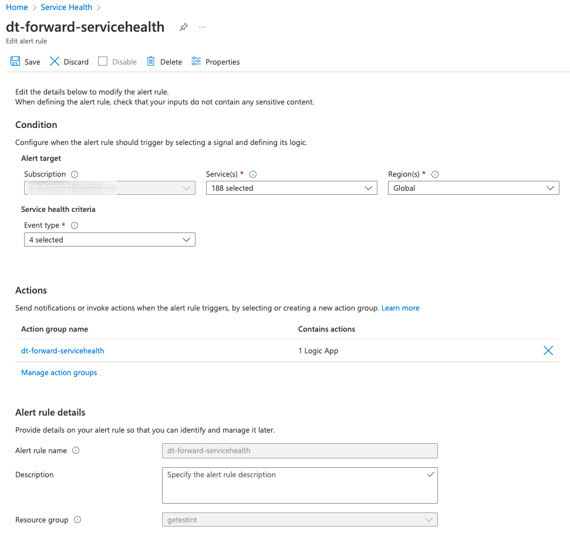
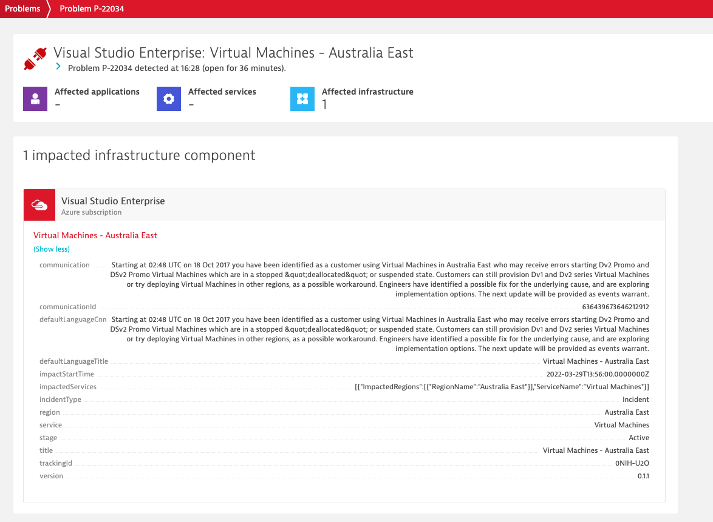
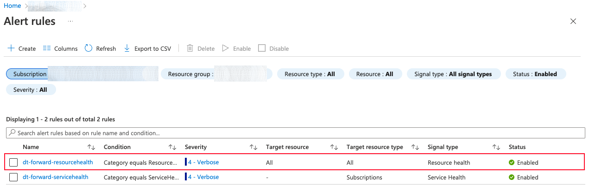
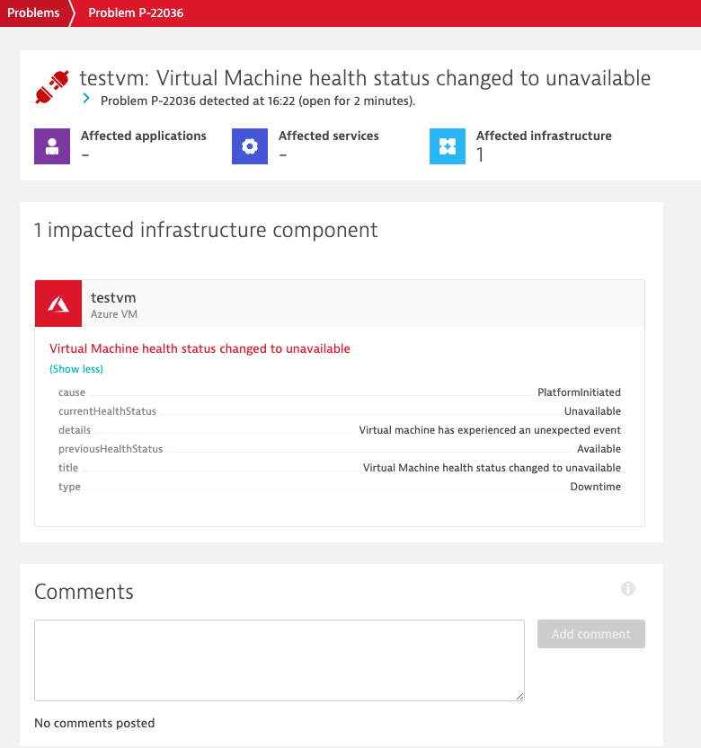

# Overview
[Dynatrace Azure Monitoring](https://www.dynatrace.com/technologies/azure-monitoring/) allows customers to combine deep observability, AIOps, and application security in one open, unified platform to continuously deliver precise answers and intelligent automation from data.

Your teams are able to:

- Innovate faster, with less risk
- Operate more efficiently and proactively
- Consistently drive better business outcomes

The Azure Health Integration solution allows Dynatrace customers to quickly and easily configure ingestion of Azure Platform Health events. By forwarding Azure health data to Dynatrace we are able to track events like ongoing service issues, upcoming planned maintenance, and relevant health advisories which may impact an organization's cloud estate from a single Observability platform.

Azure provides two categories of Health information :
- [Azure Service Health](https://docs.microsoft.com/en-us/azure/service-health/service-health-overview), tracks four types of health events that may impact your resources - Service issues, Planned maintenance, Health advisories & Security advisories.
- [Azure Resource Health](https://docs.microsoft.com/en-us/azure/service-health/resource-health-overview), relies on signals from different Azure services to assess whether a resource is healthy and reports one of the following statuses - Available, Unavailable, Unknown, Degraded. These events can be either Platform or Non-platform events, the later being intitiated by cloud customers i.e. stopping a virtual machine.

This solution currently supports the following [Resource types and health checks for Azure resource health](https://docs.microsoft.com/en-us/azure/service-health/resource-health-checks-resource-types)

- Virtual Machines
- Virtual Machine Scale Sets
- Web Apps
- App Service Plans
- Azure Kubernetes Services (AKS)

The list of supported resources can be expanded over time as needed.

## Deploy Azure Health Integration

This solution is designed to be a low code and low operational impact solution which is deployed on a per Azure subscription basis.

### Requirements
- [Azure CLI](https://docs.microsoft.com/en-us/cli/azure/) 
- [Azure Bicep](https://docs.microsoft.com/en-us/cli/azure/bicep?view=azure-cli-latest#az-bicep-install) 

### Deployment Steps

1. Generate [Dynatrace Access Token](https://www.dynatrace.com/support/help/get-started/access-tokens) with ***events.ingest*** permission.



2. Next we need to deploy the required Azure Resources for forwarding health events to Dynatrace.
- Create new/or use an existing Azure Resource Group

```bash
az group create --name ***resource-group-name*** --location ***region-name***
```

- Deploy the Azure Logic Apps, configure Action Group and Activity Log Events.

```bash
az deployment group create --resource-group ***resource-group-name*** --template-file ./src/azure-health-integration.bicep --parameters dynatraceAccessToken=***dynatrace-access-token***  --parameters dynatraceEnvironmentUrl=https://***dynatrace-environment-url***
```

### Azure Service Health Alert Forwarders

To simplify this solution we deploy two seperate Azure Logic Apps, each responsible for a different type of health event; these workflows are triggered by a Azure Health Service alert and the event payload is transformed and forwarded to your Dynatrace environment.



### Azure Service Health Alert Rule

We configure a [Azure Service Health Alert Rule](https://docs.microsoft.com/en-us/azure/service-health/alerts-activity-log-service-notifications-portal) which is triggered for all health event types across all Azure Services globally.



### Dynatrace Problem Type

We map each incoming Azure Service Health event to a Dynatrace Problem [Event Type](https://www.dynatrace.com/support/help/how-to-use-dynatrace/problem-detection-and-analysis/basic-concepts/event-types), the current mappings are as follows:

- ActionRequired – ERROR_EVENT
- Maintenance – CUSTOM_INFO
- Informational – CUSTOM_INFO
- Security – CUSTOM_INFO
- Incident - ERROR_EVENT

### Dynatrace Problem

Ingested Azure Service Health events are associated with a monitored Azure subscription and if possible they are also associated with the impacted service in Dynatrace's entity model using the following [mapping](src/entity-mappings.json). In the process the health event payload is transformed into a [Problem Report](https://www.dynatrace.com/support/help/how-to-use-dynatrace/problem-detection-and-analysis/basic-concepts/problem-overview-page) in the Dynatrace platform, which is active for 24 hours.



### Azure Resource Health Alert Rule

We also configure a [Azure Resource Health Alert Rule](https://docs.microsoft.com/en-us/azure/service-health/resource-health-alert-monitor-guide) which is triggered for Platform initiated health events for all Azure Services deployed to your Azure subscription.



### Dynatrace Problem Type

We map each incoming Azure Resource Health event to a Dynatrace Problem [Event Type](https://www.dynatrace.com/support/help/how-to-use-dynatrace/problem-detection-and-analysis/basic-concepts/event-types), the current mappings are as follows:

- Available – CUSTOM_INFO
- Unavailable – CUSTOM_INFO
- Degraded – ERROR_EVENT

### Dynatrace Problem

Ingested Azure Reasource Health events are associated with the monitored resource in Dynatrace's entity model using the following [mapping](src/entity-mappings.json). In the process the health event payload is transformed into a [Problem Report](https://www.dynatrace.com/support/help/how-to-use-dynatrace/problem-detection-and-analysis/basic-concepts/problem-overview-page) in the Dynatrace platform, which is active for 24 hours.




